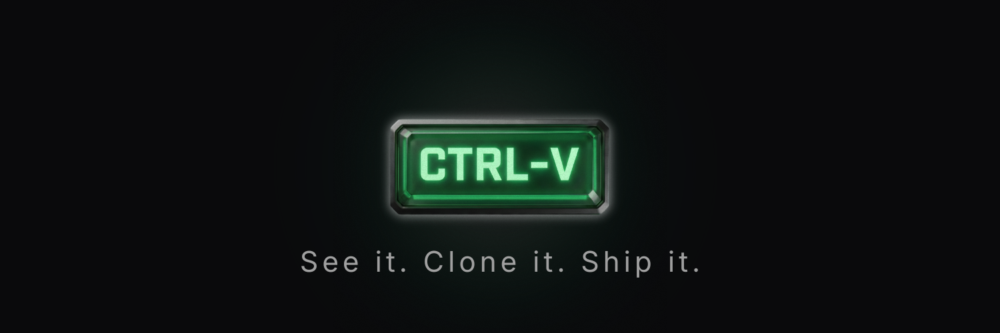

<p align="center">
  
</p>

# Beta Launch 🚀

A Chrome extension that enables one-click cloning of meme tokens from Axiom.trade and launching them on Pump.fun.

Created by [@kaelxsol](https://twitter.com/kaelxsol) | [$beta](https://axiom.trade/meme/2rYj8nHynSmubF2hb7j7m5ovm3CGyymoEzKkf5fepump)

## Features

- 🎯 **One-Click Clone** - Inject "Clone" buttons into Axiom.trade token cards
- 📋 **Auto-Extract Data** - Automatically scrape token name, ticker, description, and image
- 🖼️ **Image Pipeline** - Download images from Axiom CDN and re-upload to IPFS
- 💳 **Wallet Support** - Connect Phantom, Solflare, or generate burner wallets
- ⚡ **Quick Launch** - Pre-filled forms for rapid token deployment
- 🎨 **Matching Theme** - UI styled to match Axiom's dark theme

## Installation

### Quick Download

1. **[Download Latest Release](../../releases/latest)** - Get the `.zip` file from the releases page
2. Extract the archive to a folder on your computer
3. Open Chrome and navigate to `chrome://extensions`
4. Enable "Developer mode" (toggle in top right)
5. Click "Load unpacked"
6. Select the extracted folder

### From Source (Development Mode)

1. Clone the repository:
   ```bash
   git clone https://github.com/kaelxsol/betalaunch.git
   ```
2. Open Chrome and navigate to `chrome://extensions`
3. Enable "Developer mode" (toggle in top right)
4. Click "Load unpacked"
5. Select the `betalaunch` folder

### From Chrome Web Store

*Coming soon*

## Usage

1. **Navigate to Axiom.trade** - Visit any token page (`axiom.trade/meme/{address}`)
2. **Click Clone Button** - Find the green "🚀 Clone" button on the token card
3. **Review Details** - Check the pre-filled form in the extension popup
4. **Connect Wallet** - Connect your Phantom/Solflare wallet or create a burner
5. **Launch** - Click "Launch on Pump.fun" and approve the transaction

## Project Structure

```
axiom-clone-launcher/
├── manifest.json          # Chrome extension manifest (V3)
├── content.js             # Content script injected into Axiom pages
├── background.js          # Service worker for background tasks
├── popup/
│   ├── popup.html         # Extension popup UI
│   ├── popup.css          # Styles (Axiom dark theme)
│   └── popup.js           # Popup logic and wallet handling
├── injected/
│   └── axiom-inject.js    # Page context injection for data extraction
├── utils/
│   ├── extractor.js       # Token data extraction utilities
│   └── pumpportal.js      # PumpPortal API integration
├── icons/                 # Extension icons
└── docs/
    └── plan.md            # Development roadmap
```

## API Integrations

### Axiom.trade
- Token data extraction from DOM
- API endpoints: `pair-info`, `token-info`, `dev-tokens-v2`
- Image CDN: `axiomtrading.sfo3.cdn.digitaloceanspaces.com`

### PumpPortal (Pump.fun)
- IPFS metadata upload: `pump.fun/api/ipfs`
- Transaction creation: `pumpportal.fun/api/trade-local`

## Development

### Prerequisites

- Node.js 18+ (for build tools)
- Chrome Browser
- Solana wallet (Phantom/Solflare) for testing

### Building

Currently, no build step required. Files are loaded directly.

For production:
```bash
# TODO: Add build script for minification
npm run build
```

### Testing

1. Load the unpacked extension
2. Visit `axiom.trade/meme/<any-token>`
3. Click the Clone button
4. Verify data extraction in popup

## Configuration

Settings are stored in Chrome's local storage:

```javascript
{
  settings: {
    defaultSlippage: 10,      // Slippage tolerance %
    defaultBuyAmount: 0.1,    // Initial buy in SOL
    autoFillEnabled: true     // Auto-populate form fields
  }
}
```

## Security Considerations

⚠️ **Important Security Notes:**

- Never share your private keys
- Burner wallets are stored locally - export keys before clearing data
- This extension requires permissions to read Axiom.trade pages
- Review transactions carefully before signing
- Use at your own risk - token launches involve real funds

## Disclaimer

This tool is for educational purposes. Cloning tokens may have legal implications depending on your jurisdiction. Always respect intellectual property rights and do your own research before launching any token.

## Contributing

Contributions welcome! Please read the [plan.md](docs/plan.md) for the development roadmap.

## License

MIT License - See LICENSE file for details.

---

**Built with 💚 for the Solana meme coin community**
